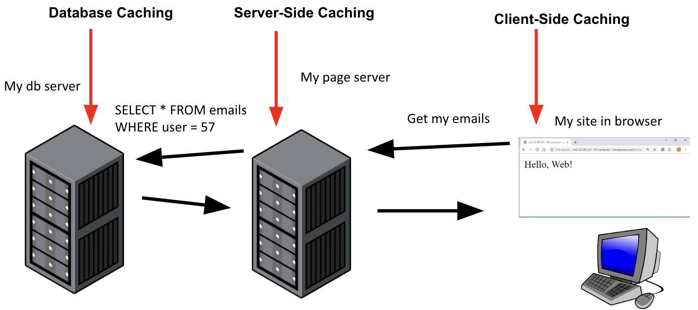

---
hide:
  - navigation
  - toc
---

<small><i>Last modified: {{ git_revision_date_localized }}</i></small>

<div class="back-button">
    <br>
    <a href="javascript:history.back()">← Back</a>
    <br>
    <br>
</div>

# Caching

- Saving the results of a calculation or request so that in the future, those results can be reused instead of redoing the calculation or request

	- Caching is often the best first step to make your site faster and able to handle more users

- Benefits: Makes calculations or requests run faster (or skips them entirely)

- Risks: The results you saved may be out of date (stale)

- Also, some requests can’t be cached for different reasons:

	- The response may be unique each time (e.g., generate a random number)

	- You want the server to perform an action (e.g., POST or DELETE requests)

	- You always want most up to date (e.g., bank account balance)


### Caching locations



<br>
app.js
```
import express from 'express';
import path from 'path';
import cookieParser from 'cookie-parser';
import logger from 'morgan';
import sessions from 'express-session';


// This is a public sample test API key.
// Don’t submit any personally identifiable information in requests made with this key.
// Sign in to see your own test API key embedded in code samples.
import stripeLib from 'stripe'
const stripe = stripeLib('  ');


import models from './models.js'
import itemsRouter from './routes/items.js';

import { fileURLToPath } from 'url';
import { dirname } from 'path';

const __filename = fileURLToPath(import.meta.url);
const __dirname = dirname(__filename);

var app = express();

app.use(logger('dev'));
app.use(express.json());
app.use(express.urlencoded({ extended: false }));
app.use(cookieParser());
const oneDay = 1000 * 60 * 60 * 24;
app.use(sessions({
    secret: "thisismysecrctekey",
    saveUninitialized:true,
    cookie: { maxAge: oneDay },
    resave: false 
}))
app.use(express.static(path.join(__dirname, 'public')));

app.use((req, res, next) =>{
    req.models = models
    req.stripe = stripe
    next()
})


app.use('/items', itemsRouter);

export default app;
```


items.js
```
import cache from 'memory-cache'
import express from 'express';
var router = express.Router();

// artificially slow down the response
async function getItemsSlow(req) {
    const allItems = await req.models.Item.find()

    const sleepSeconds = 5
    await new Promise(r => setTimeout(r, sleepSeconds * 1000))

    return allItems
}

router.get("/", async (req, res) => {
    console.log("got a GET request for all items, first check the cache")

    let allItems = cache.get("allItems")

    if (allItems) {
        console.log("cache hit: found items in my cache")
    }
    else {
        console.log("cache miss: doing the slow db lookup")

        // let allItems = await req.models.Item.find()
        allItems = await getItemsSlow(req);
        console.log("loaded items from db, saving to cache")
        cache.put("allItems", allItems, 30 * 1000)
    }

    // res.setHeader('Cache-Control', 'public, max-age=30')
    res.json(allItems)
})

router.post("/saveCart", async (req, res) => {
    console.log(
        "saving card, session is currently: ", 
        req.session
    )

    const cartInfo = req.body
    //TODO: validate cart info is only item ids and counts

    // for some reason if I save an object (instead of string) 
    // it gets deleted later
    req.session.cartInfo = JSON.stringify(cartInfo)

    console.log("session is now", req.session)

    res.json({status: "success"})
})

router.get('/getCart', async (req, res) => {
    if(!req.session || !req.session.cartInfo){
        // if no session or saved cart, just return empty cart
        res.json([])
        return
    }

    const cartInfo = JSON.parse(req.session.cartInfo)

    // add item names and prices to the cart info
    const combinedCartInfo = await addPricesToCart(cartInfo, req.models)

    res.json(combinedCartInfo)
})

async function addPricesToCart(cartInfo, models){
    //cartInfo should start like: [{itemId: 342, itemCount: 2}, {itemId:345, itemCount: 1}, ...]

    // look up in the db all the items listed in my cart
    const cartItemIds = cartInfo.map(cartItem => cartItem.itemId)
    const itemsInfo = await models.Item.find().where("_id").in(cartItemIds).exec()

    // itemsInfo will be an array of json, like this:
    // [{_id:342, name: "orange", price: ...}, {_id: 345, name: "apple", ...},...]

    // transform itemsInfo into an object where I can look up info by the id
    let itemsInfoById = {}
    itemsInfo.forEach(itemInfo => {
        itemsInfoById[itemInfo._id] = itemInfo
    })

    // itemsInfoById will look like
    // {
    //  342: {_id:342, name: "orange", price: ...}
    //  345: {_id: 345, name: "apple", ...}
    // }

    // take the cartInfo, and for each item, make a new object that includes the name and price
    const combinedCartInfo = cartInfo.map(cartItem => {
        return {
            itemId: cartItem.itemId, // from user cart
            itemCount: cartItem.itemCount, // from user cart
            name: itemsInfoById[cartItem.itemId].name, // from the db
            price: itemsInfoById[cartItem.itemId].price // from the db
        }
    })
    return combinedCartInfo
}

async function calculateOrderAmount(req){
    // get cart info, combine with prices, calculate the total price
    const cartInfo = JSON.parse(req.session.cartInfo)

    const combinedCartInfo = await addPricesToCart(cartInfo, req.models)

    const totalCost = combinedCartInfo
        .map(item => item.price * item.itemCount) // get cost for each item type
        .reduce((prev, curr) => prev + curr)

    return totalCost
}


router.post('/create-payment-intent', async (req, res) => {
    //look up the order amount
    let orderAmount = await calculateOrderAmount(req)

    // create a PaymentIntent object with the order amount
    const paymentIntent = await req.stripe.paymentIntents.create({
        amount: orderAmount * 100,
        currency: "usd", // note: 'usd' is actually US cents for some reason (US dollars * 100)
        automatic_payment_methods: {
            enabled: true
        }
    })

    res.send({
        clientSecret: paymentIntent.client_secret
    })
})

export default router;
```