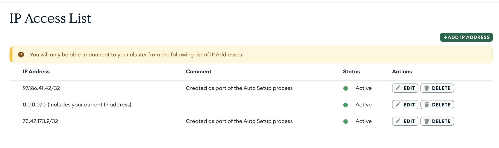

---
hide:
  - navigation
  - toc
---

<small><i>Last modified: {{ git_revision_date_localized }}</i></small>

<div class="back-button">
    <br>
    <a href="javascript:history.back()">← Back</a>
    <br>
    <br>
</div>

# MongoDB Connection

```
import mongoose from 'mongoose'

let models = {}

console.log('Connecting to mongodb')

// TODO: Insert mongodb connection URL below
await mongoose.connect('mongodb://localhost:27017/userDemo)

console.log('Connected to mongodb')

const userSchema = new mongoose.Schema({
	first_name: String,
	last_name: String,
	favorite_ice_cream: String
})

models.User = mongoose.model('User', userSchema)

export default models
```
<br>

> remember to edit IP access list
>
> 