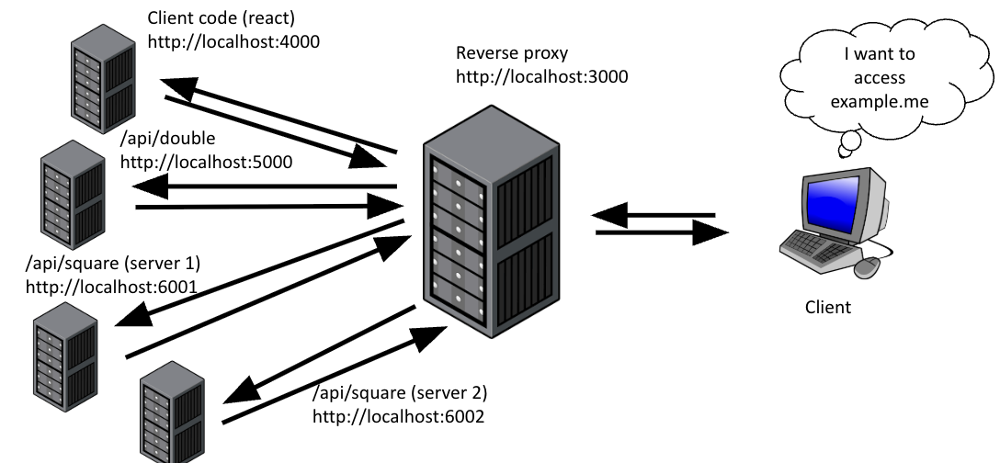

---
hide:
  - navigation
  - toc
---

<small><i>Last modified: {{ git_revision_date_localized }}</i></small>

<div class="back-button">
    <br>
    <a href="javascript:history.back()">← Back</a>
    <br>
    <br>
</div>

# Microservices and Proxies

### Forward Proxy

A server that sits between a client (like your computer) and the internet. Forwards your requests to websites and sends the responses back to you. It hides the client from the server.

Uses:  

- Security (firewalls)

- Anonymity (VPNs, or hackers)

- Caching


### Reverse Proxy

A server that sits in front of web servers. It receives requests from clients and forwards them to the appropriate backend server. It hides the server from the client.

Benefits:  

- Transparent to client

- Scalable


### Microservices

What are they good at?
- Scaling different parts of your app up or down
- Letting individuals teams choose their own favorite technology
	- Maybe the /login team loves C# and the /getAllVideosForUser team loves JavaScript… with microservices, you can let each group choose
- Troubleshooting/rollouts/rollbacks are by endpoint

<br>

#### set environment variables before running npm start (mac)
```
export DEBUG="express:* express-starter:server"
export DEBUG="http-proxy-middleware* node server.js"

export PORT=3000
```
> macbook has airplay on port 5000, turn off in setting first

<br>

#### Load Balancing Proxy
```
import request from 'request';

const servers = ['http://localhost:6001', 'http://localhost:6002' ];
let cur_server_index = 0;
app.use('/api/square', (req, res) => {
  try {
  	cur_server_index = (cur_server_index  + 1) % servers.length;
  	req.pipe(request({ url: servers[cur_server_index] + req.originalUrl })).pipe(res);
  } catch (error) {
	console.log("error in /api/square:" + error)
	res.status(500).json({status: "error", error: error});
  }
})
```

<br>

```
microservices/
├── express-reverse-proxy/
│   └── app.js
├── express-reverse-double/
│   └── app.js
├── express-reverse-square/
│   └── app.js
└── react-client/
```

express-reverse-proxy/app.js
```
import express from 'express';
import path from 'path';
import cookieParser from 'cookie-parser';
import logger from 'morgan';
import { createProxyMiddleware } from 'http-proxy-middleware'
import request from 'request'

import usersRouter from './routes/users.js';

import { fileURLToPath } from 'url';
import { dirname } from 'path';

const __filename = fileURLToPath(import.meta.url);
const __dirname = dirname(__filename);

var app = express();

app.use(logger('dev'));
app.use(express.json());
app.use(express.urlencoded({ extended: false }));
app.use(cookieParser()); 

app.use('/users', usersRouter);

app.get('/api/double', createProxyMiddleware({
    target: 'http://localhost:5000'
}))

const servers = ['http://localhost:6001', 'http://localhost:6002']
let cur_server_index = 0
app.get('/api/square', (req, res) => {
    try {
        cur_server_index = (cur_server_index + 1) % servers.length
        req
            .pipe(request({
                url: servers[cur_server_index] + req.originalUrl
            }))
            .pipe(res)
    } catch (err) {
        console.log("Error in /api/square: ", err)
        res.status(500).json({ status: "error", error: err })
    }
})

app.use('/*', createProxyMiddleware({
    target: 'http://localhost:4000',
    pathRewrite: (path, req) => req.baseUrl,
    changeOrigin: true
}))


export default app;
```


express-service-double/app.js
```
import express from 'express';
import path from 'path';
import cookieParser from 'cookie-parser';
import logger from 'morgan';

import usersRouter from './routes/users.js';

import { fileURLToPath } from 'url';
import { dirname } from 'path';

const __filename = fileURLToPath(import.meta.url);
const __dirname = dirname(__filename);

var app = express();

app.use(logger('dev'));
app.use(express.json());
app.use(express.urlencoded({ extended: false }));
app.use(cookieParser());
app.use(express.static(path.join(__dirname, 'public')));

app.use('/users', usersRouter);

app.get('/api/double', (req, res) => {
    let num = req.query.num
    let doubled = num * 2
    res.send("" + doubled)
})

export default app;
```

express-service-square/app.js
```
import express from 'express';
import path from 'path';
import cookieParser from 'cookie-parser';
import logger from 'morgan';

import usersRouter from './routes/users.js';

import { fileURLToPath } from 'url';
import { dirname } from 'path';

const __filename = fileURLToPath(import.meta.url);
const __dirname = dirname(__filename);

var app = express();

app.use(logger('dev'));
app.use(express.json());
app.use(express.urlencoded({ extended: false }));
app.use(cookieParser());
app.use(express.static(path.join(__dirname, 'public')));

app.use('/users', usersRouter);

app.get('/api/square', (req, res) => {
    let num = req.query.num
    let squared = num * num
    res.send("" + squared)
})

export default app;
```

<br>

