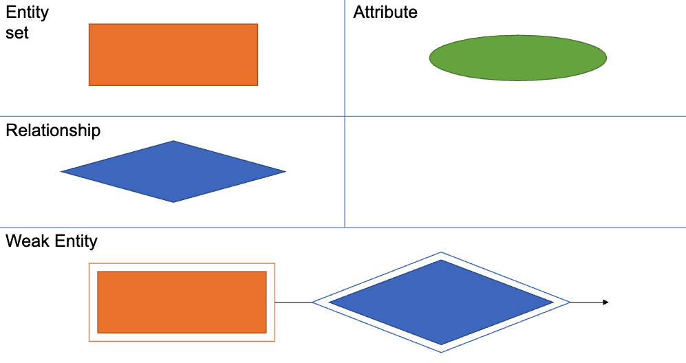

---
hide:
  - navigation
  - toc
---

<small><i>Last modified: {{ git_revision_date_localized }}</i></small>

     
    <a href="javascript:history.back()">← Back</a>
     
     

# Entity Relation Diagram

- An **entity** corresponds to an instance of an object
	- corresponds to a row in an RDBMS table
- An attribute corresponds to a field  
- An entity set is a collection of entities of the same type
- Underline indicates the attribute is part of the Primary Key