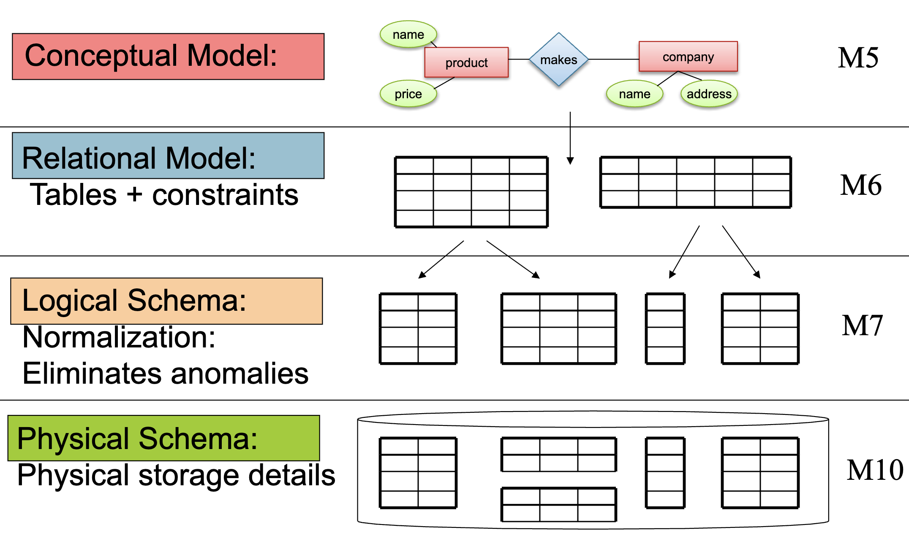
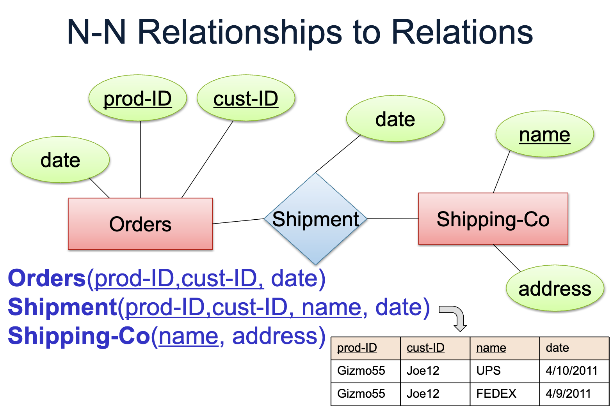
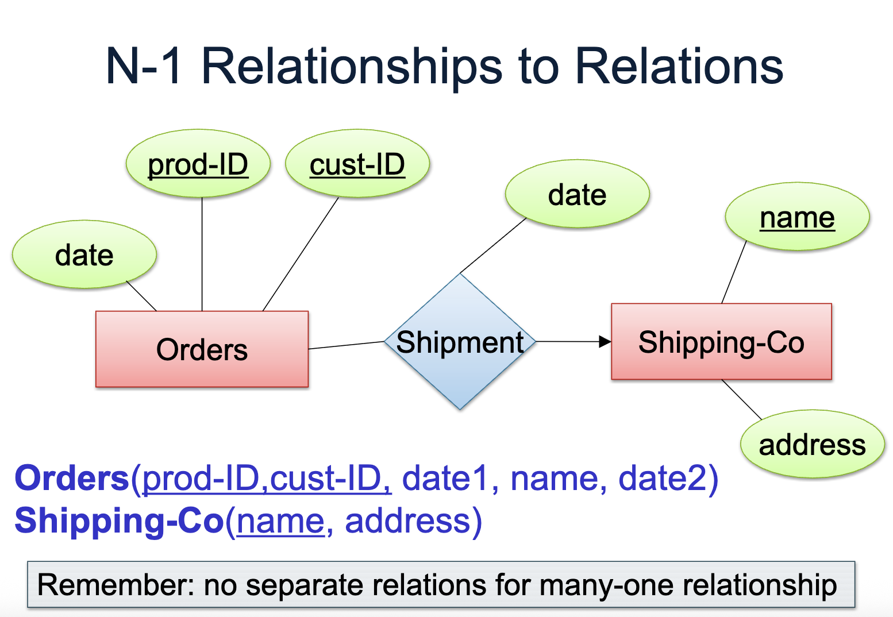

---
hide:
  - navigation
  - toc
---

<small><i>Last modified: {{ git_revision_date_localized }}</i></small>

     
    <a href="javascript:history.back()">← Back</a>
     
     

# From ER Diagram to Relational Schema

### Database design process

Conceptual Model -> Relational Model  
&nbsp;&nbsp;&nbsp;&nbsp;+ schema  
&nbsp;&nbsp;&nbsp;&nbsp;+ constraints

 

 

