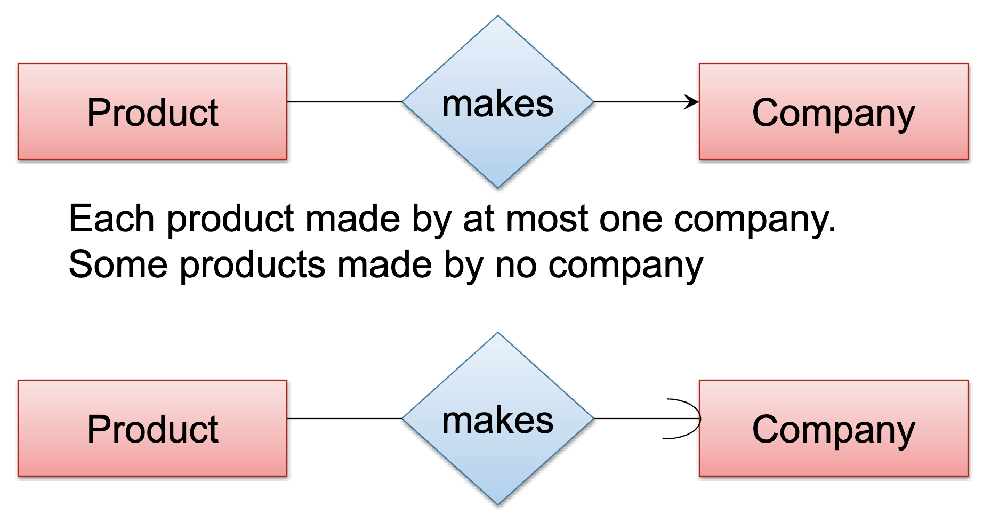
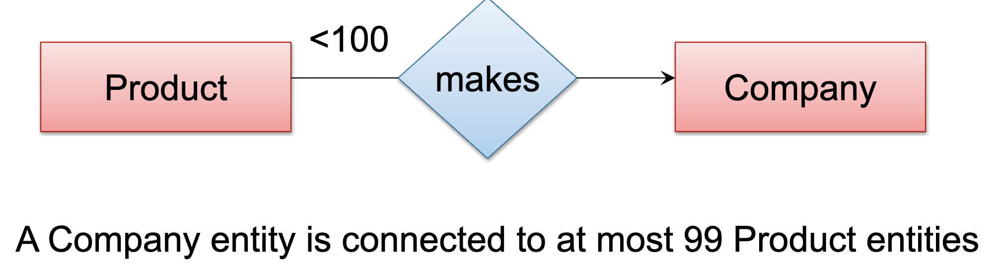

---
hide:
  - navigation
  - toc
---

<small><i>Last modified: {{ git_revision_date_localized }}</i></small>

<div class="back-button">
    <br>
    <a href="javascript:history.back()">← Back</a>
    <br>
    <br>
</div>

# FK Constraints



<br>



<br>

What should the DB engine do if execution SQL statement collides with a FOREIGN KEY constraint?  
&nbsp;&nbsp;&nbsp;&nbsp; For example:  `DELETE FROM Company WHERE name = ‘lmao’;`  
&nbsp;&nbsp;&nbsp;&nbsp;&nbsp;&nbsp;&nbsp;&nbsp; and the Products Table contains Foreign Key entries for  `cname = ‘lmao’`

<br>

ON DELETE / ON UPDATE Options  

- NO ACTION  
	Default behavior; Raises an error and the Delete/Update is rolled back

- CASCADE  
	Automatically fixes the referencing Table; on UPDATE, corresponding rows are changed

- SET NULL  
	Automatically fixes the referencing Table; FOREIGN KEY column must be NULLABLE

- SET DEFAULT  
	Automatically fixes the referencing Table; FOREIGN KEY column must have DEFAULT value defined


```
CREATE TABLE Company (
	name VARCHAR(100) PRIMARY KEY);
	CREATE TABLE Product (
	name VARCHAR(100) PRIMARY KEY,
	cname VARCHAR(100) REFERENCES Company (name)
	ON UPDATE CASCADE
	ON DELETE SET NULL);
```

<br>

#### Weak Entity Set -> Foreign Key + Cascade Delete
```
CREATE TABLE Team (  
	univname CHAR(30) REFERENCES University(name)  
	ON DELETE CASCADE ON UPDATE CASCADE,  
	number int,
	sport CHAR(30))
```