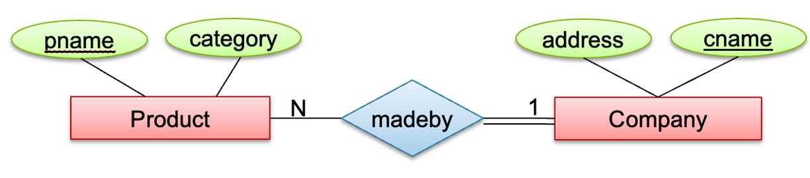

---
hide:
  - navigation
  - toc
---

<small><i>Last modified: {{ git_revision_date_localized }}</i></small>

<div class="back-button">
    <br>
    <a href="javascript:history.back()">← Back</a>
    <br>
    <br>
</div>

# Mandatory Relationship


```
CREATE TABLE Product (
    product_id INT PRIMARY KEY,
    pname VARCHAR(50),
    category VARCHAR(50),
    company_id INT,  --(can be NULL)
    FOREIGN KEY (company_id)
  REFERENCES Company(company_id)
);
```

<br>



```
CREATE TABLE Product (
    product_id INT PRIMARY KEY,
    pname VARCHAR(50),
    category VARCHAR(50),
    company_id INT NOT NULL,  --(cannot be NULL)
    FOREIGN KEY (company_id)
  REFERENCES Company(company_id)
);
```