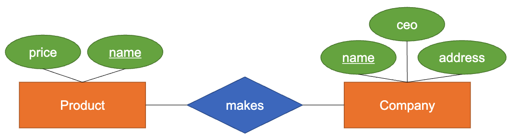
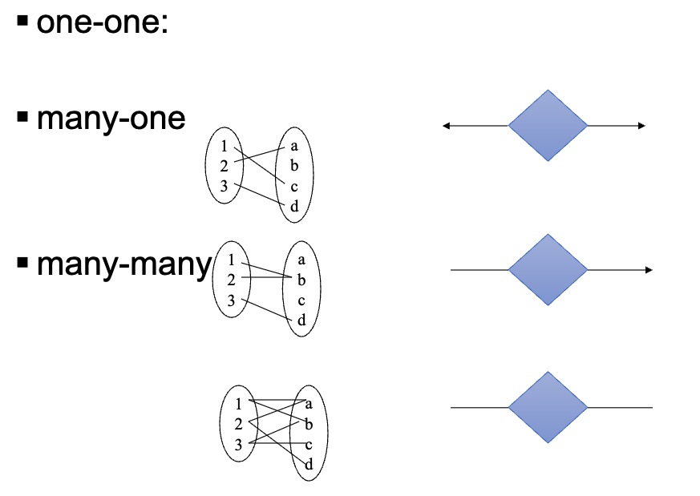
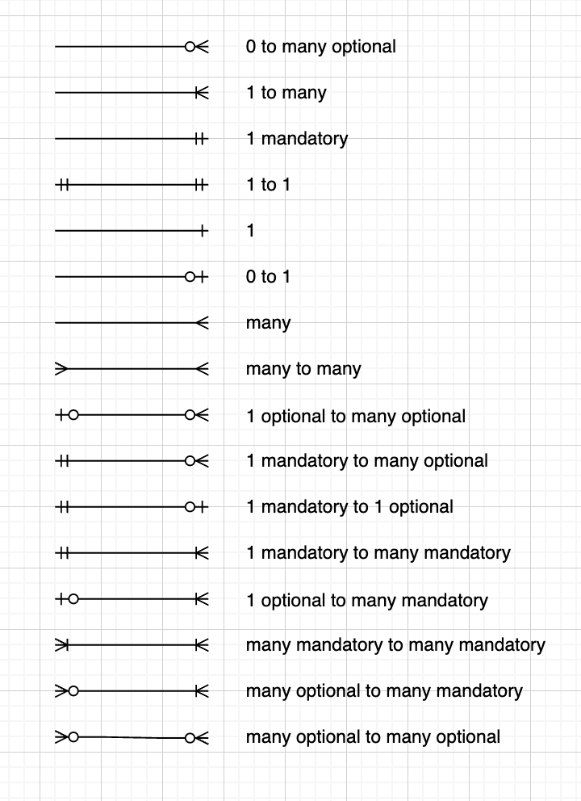
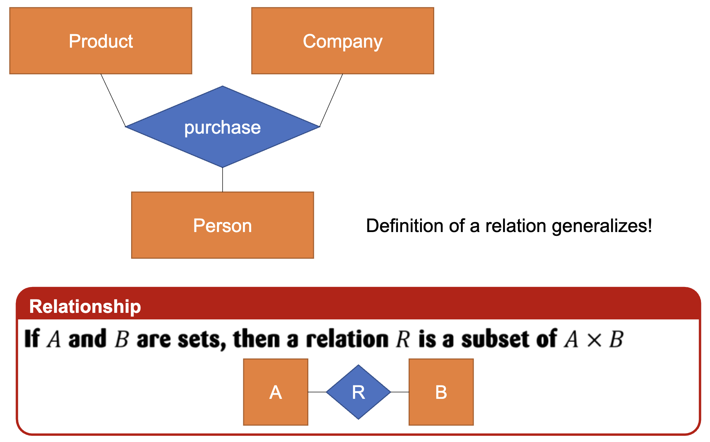
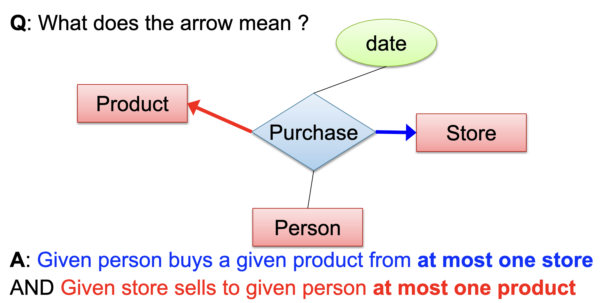

---
hide:
  - navigation
  - toc
---

<small><i>Last modified: {{ git_revision_date_localized }}</i></small>

     
    <a href="javascript:history.back()">← Back</a>
     
     

# Relationship

If A and B are sets, then a relation R is a subset of A * B

 

- One-to-one
- One-to-many; Many-to-one
- Many-to-many

 

 

### Multiplicity & Cardinality

- In UML, multiplicity specifies lower and upper bound constraints on the cardinality of a relationship

| Multiplicity | Cardinality | Description                                  |
| ------------ | ----------- | -------------------------------------------- |
| 0..0         | 0           | Collection must be empty                     |
| 0..1         |             | Either zero or one instance                  |
| 1..1         | 1           | Exactly one instance                         |
| 0..*         | *           | Zero or more instances                       |
| 1..*         |             | One or more instance                         |
| 5..5         | 5           | Exactly 5 instances                          |
| m..n         |             | At least *m*, but no more than *n* instances |

 
### Multi-way Relationships

**A** and **B** are two sets (collections of things).
    
Example:  
A = {Person1, Person2}  
B = {Product1, Product2}
        
**A × B** (called the "Cartesian product") is **all possible combinations** of one item from A and one item from B.  
    A × B = { (Person1, Product1), (Person1, Product2), (Person2, Product1), (Person2, Product2) }
    
**Relation R** is **some subset** of A × B — meaning R just **picks certain pairs** out of A × B that actually make sense for the relationship you're modeling.

