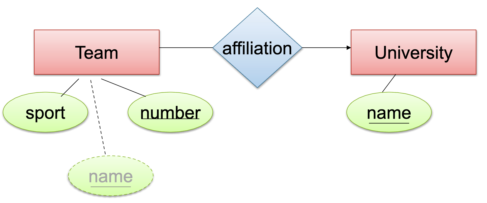

---
hide:
  - navigation
  - toc
---

<small><i>Last modified: {{ git_revision_date_localized }}</i></small>

     
    <a href="javascript:history.back()">← Back</a>
     
     

# Weak Entity Sets

- A **weak entity** can't be uniquely identified by its own attributes alone.
- It **depends** on a **strong entity** (another table/entity) for its **primary key**.
- From the example:
	**University(name)** → Strong entity (can be identified just by `name`).
	**Team(sport, number, universityName)** → Weak entity (needs `universityName` to uniquely identify a Team).
        
Without the university's name, you might have multiple teams with the same sport and number — but _which_ university they belong to would be unclear.

 

Why do we care about Weak Entities?

1. **Avoid Duplicating Keys**:
    - Instead of copying the whole key into every weak entity, you reference it simply.

2. **Reflect Logical Structure**:
    - It models real-world dependency — e.g., a Team exists only **because** a University exists.

3. **Automatic Deletion**:
    - If the **strong entity** (like a University) is deleted, the **dependent weak entities** (like its Teams) should automatically be deleted too.