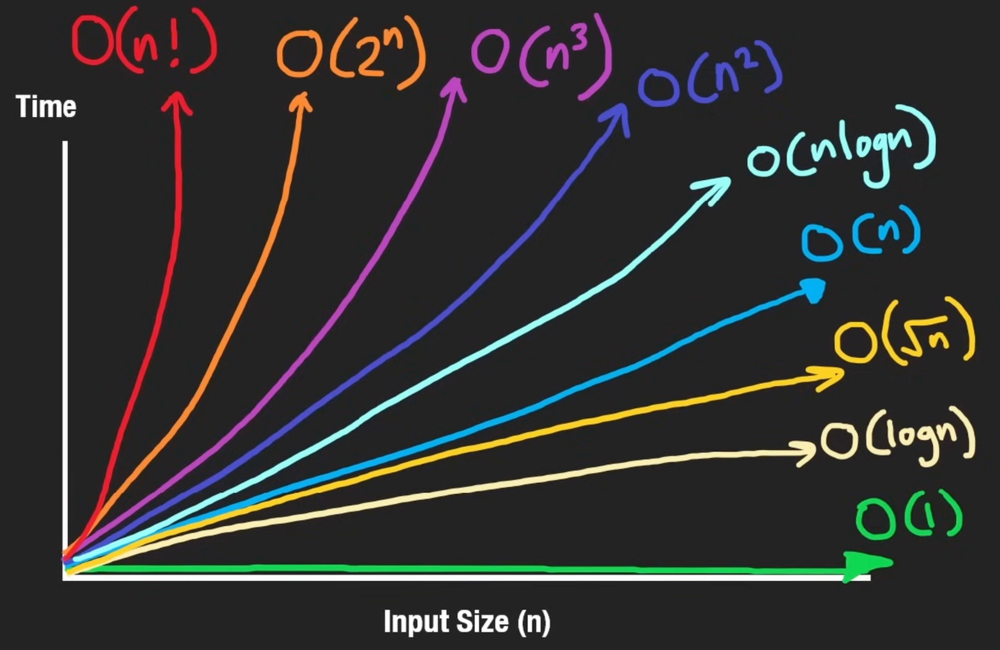

---
hide:
  - navigation
  - toc
---

<small><i>Last modified: {{ git_revision_date_localized }}</i></small>

<div class="back-button">
    <br>
    <a href="javascript:history.back()">← Back</a>
    <br>
    <br>
</div>

# Big-O Notation

A way of analyzing time it takes for our algorithm to execute as the input size grows.  
worst-case runtime

<br>

### $O(1)$

No matter how much our input size grows, the time complexity of O(1) algorithms is always the same.  
Most efficient algorithm

```
# Aray
nums = [1, 2, 3]
nums.append(4)
nums.pop()
nums[0]

# HashMap / Set
hashMap = {}
hashMap["key"] = 10
hashMap.pop("key")
```

<br>

### $O(n)$

Linear growth scenario  
as our input size grows, our time grows proportionally

```
nums = [1, 2, 3]
sum(nums)
for n in nums:
	print(n)

nums.insert(1, 100)
nums.remove(100)

import heapq
heapq.heapify(nums)
```

<br>

### $O(n^2)$

Nested loops; two-dimensional arrays

```
nums = [[1, 2, 3], [4, 5, 6], [7, 8, 9]]
for i in range(len(nums)):
	for j in range(len(nums[i])):
		print(nums[i][j])

nums = [1, 2, 3]
for i in range(len(nums)):
	for j in range(i+1, len(nums)):
		print(nums[i], nums[j])

# Insertion sort
```

<br>

### $O(n * m)$

A two-dimensional matrix that's not necessarily a square

```
nums1, nums2 = [1, 2, 3][4, 5]
for i in range(len(nums1)):
	for j in range(len(nums2)):
		print(nums1[i], nums2[j])
```

<br>

### $O(Log \space n)$

on every iteration of the loop, we eliminate half of the elements from consideration; we cut array in half until we have nothing remain

given an array of size n, how many times can you cut the value n by two until it equals 1?  
$\rightarrow$ how many times can you take the value 1 and multiply by two until it's equal to n

```
# binary search
nums = [1, 2, 3, 4, 5]
target = 6
l, r = 0, len(nums) - 1
while l <= r:
	m = (l + r) // 2
	if target < nums[m]
		r = m - 1
	elif target > nums[m]:
		l = m + 1
	else:
		print(m)
		break

# binary search on BST
def search(root, target):
	if not root:
		return False
	if target < root.val:
		return search(root.left, target)
	elif target > root.val:
		return search(root.right, target)
	else:
		return True
```

<br>

### $O(n \space Log \space n)$

```
# sort
nums.sort()

# HeapSort
import heapq
nums = [1, 2, 3, 4, 5]
heapq.heapify(nums) # O(N)
while nums:
	heapq.heappop(nums) # O(log n)

# MergeSort
# (and most built-in sorting functions)
```

<br>

### $O(2^n)$

recursion; Fibonacci recursively

```
# recursion, tree height n, two branches
def recursion(i, nums):
	if i == len(nums):
		return 0
	branch1 = recursion(i + 1, nums)
	branch2 = recursion(i + 2, nums)
```

<br>

### $O(C^n)$

```
# c branches, where c is sometimes n
def recursion(i, nums, c):
	if i == len(nums):
		return 0
	
	for j in range(i, i + c):
		branch = recursion(j + 1, nums)
```

<br>

### $O(\sqrt n)$

```
# Get all factors of n
n = 12
factors = set()
for i in range(1, int(math.sqrt(n)) + 1):
	if n % 1 == 0:
		factors.add(i)
		factors.add(n // i)
```

<br>

### $O(n!)$

Permutations; traveling salesman problem.  
very inefficient

i.e. [#46](https://leetcode.com/problems/permutations/description/)
```
def permute(self, nums: List[int]) -> List[List[int]]:
    perms = [[]]

    for n in nums:
    new_perms = []
        for p in perms:
            for i in range(len(p)+1):
                p_copy = p.copy()
                p_copy.insert(i, n)
                new_perms.append(p_copy)
        perms = new_perms
        
    return perms
```

<br>
<br>



<br>

**Source:** [Big-O Notation](https://www.youtube.com/watch?v=BgLTDT03QtU) (NeetCode)